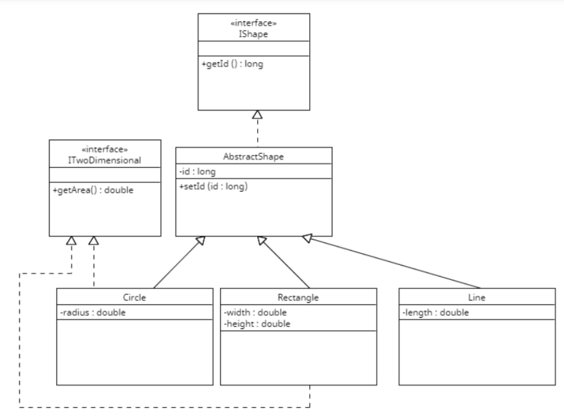

** Enhance Classes**

• Στις concrete κλάσεις της εργασίας του προηγούμενου κεφαλαίου προσθέστε τις equals και hashCode σε όλες τις κλάσεις της εφαρμογής, όπως Line, Circle, Rectangle

-- Προσθέστε copy constructors
-- Κάντε τις Serializable
-- Κάντε τις Cloneable